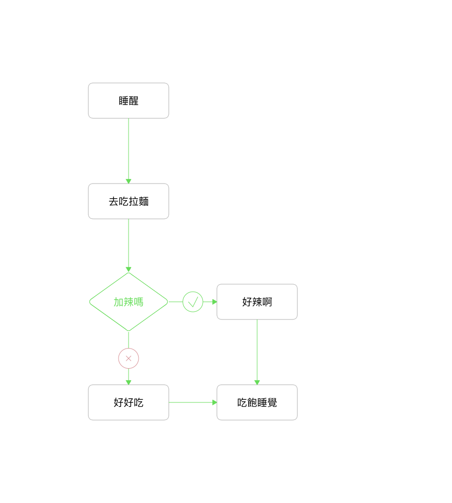

# jsToDiagram

Current Version: 0.1.0 (Unpackage Internal Testing Version :+1:)

## Description

A tools for generating diagram by code.

## Concept(Example)

Using below code:
```javascript
import jsToDiagram from './jsToDiagram'; 

const config = {
	savePath: './test.png',
	showPoint: false,//是否显示连接点
}

var mvcDiagram = new jsToDiagram(config);

//Sample 0
var wakeBlock = mvcDiagram.create('block','睡醒');
var prettyBlock = mvcDiagram.create('block','去吃拉麵');
var judgeBlock = mvcDiagram.create('Judge','加辣嗎');
var noeatBlock = mvcDiagram.create('block','好好吃');
var eatBlock = mvcDiagram.create('block','好辣啊');
var hotelBlock = mvcDiagram.create('block','吃飽睡覺');

wakeBlock.singleLink(prettyBlock);
prettyBlock.judge(judgeBlock,eatBlock,noeatBlock);
eatBlock.singleLink(hotelBlock);
noeatBlock.singleLink(hotelBlock);

mvcDiagram.draw((err) =>{
	if (err)throw err;
	console.log('Draw done')
});
```
And we can get the below diagram:


## History

Frankly speaking, it's just a demo currently, 
I am optimizing the algorithm, I hope this tools can help your work in the future.

- 0.1.0 Demo (Achieve)
- 0.5.0 Novel Algorithm (Pending - Mid of May 2018)
- 1.0.0 Milestone Version (Pending - End of May 2018)
- 1.5.0 Privode front-end version (Pending - End of June 2018)
